# The YOLO26 Model

`vision_rs::models::yolo::yolo26` implements
`ultralytics/cfg/models/26/yolo26.yaml`: a CSP-style backbone, an FPN neck,
and one or two detection heads, with `reg_max = 1` (YOLO26 drops DFL
compared to earlier YOLO versions).

## Variants

```rust,ignore
pub enum Yolo26Variant { N, S, M, L, XL }
```

Each variant has a `depth`/`width`/`mc` (max channels) scaling triple,
returned by `Yolo26Variant::config()`:

| Variant | depth | width | max channels |
|---------|-------|-------|---------------|
| N       | 0.5   | 0.25  | 1024          |
| S       | 0.5   | 0.50  | 1024          |
| M       | 0.5   | 1.00  | 512           |
| L       | 1.0   | 1.00  | 512           |
| XL      | 1.0   | 1.50  | 512           |

Two helper functions scale the yaml's base values by these multipliers:
`ch(base, width, mc)` scales a channel count (capped at `mc`), and
`rep(base, depth)` scales a block repeat count (minimum 1).

## Backbone + FPN neck

`build_neck` constructs the shared backbone and neck, returning a closure
`Fn(SymTensor) -> (SymTensor, SymTensor, SymTensor)` producing the three FPN
feature maps `(p3d, p4d, p5d)` at strides 8/16/32, plus the three
corresponding channel widths.

```mermaid
graph TD
    In[Input image] --> L0["conv (stride 2)"] --> L1["conv (stride 2)"]
    L1 --> L2[c3k2] --> L3["conv (stride 2)"]
    L3 --> L4[c3k2] --> P3["p3 (stride 8)"]
    P3 --> L5["conv (stride 2)"] --> L6[c3k2] --> P4["p4 (stride 16)"]
    P4 --> L7["conv (stride 2)"] --> L8[c3k2] --> L9[sppf] --> L10[c2psa] --> P5["p5 (stride 32)"]

    P5 --> Up1[upsample] --> Cat1[concat with p4]
    Cat1 --> L13[c3k2] --> Nk4[nk4]
    Nk4 --> Up2[upsample] --> Cat2[concat with p3]
    Cat2 --> L16[c3k2] --> P3D["p3d (to head)"]
    P3D --> L17["conv (stride 2)"] --> Cat3[concat with nk4]
    Cat3 --> L19[c3k2] --> P4D["p4d (to head)"]
    P4D --> L20["conv (stride 2)"] --> Cat4[concat with p5]
    Cat4 --> L22[c3k2_psa] --> P5D["p5d (to head)"]
```



Every layer is wrapped in a `name_scope` matching its yaml layer index
(`model.0` through `model.22`) — this is what lets weight loading map a
pretrained checkpoint's parameter names onto the traced graph.

Blocks (see [`models::yolo::yolo26::blocks`](https://docs.rs/vision-rs/latest/vision_rs/models/yolo/yolo26/blocks/index.html)):

- **`conv`** — Conv2d + BatchNorm + activation.
- **`c3k2`** — the CSP bottleneck variant used throughout backbone/neck.
- **`c2psa`** / **`c3k2_psa`** — cross-stage-partial blocks with
  position-sensitive attention (see [Custom Kernels](../kernels-and-performance/custom-kernels.md)).
- **`sppf`** — Spatial Pyramid Pooling - Fast.
- **`upsample`** / **`concat`** — nearest-neighbor upsampling and
  channel-wise concatenation, used to build the FPN top-down path.

## Detection heads

```rust,ignore
pub enum DetectHead { OneToMany, OneToOne }
```

`OneToMany` binds to the `cv2`/`cv3` weight namespace (the dense training
head); `OneToOne` binds to `one2one_cv2`/`one2one_cv3` (the head used for
inference, matching ultralytics eval-mode mAP). `yolo26(nc, variant, head)`
builds a single-head forward closure producing raw `DetectOutput { boxes,
scores }` (training-mode layout — apply detect-decode with the anchor
grid/strides for inference-ready boxes; see
[Custom Kernels](../kernels-and-performance/custom-kernels.md)).

`yolo26_dual(nc, variant)` traces **both** heads in one graph, sharing the
backbone/neck, for dual-assignment training — see
[Training](./training.md).
